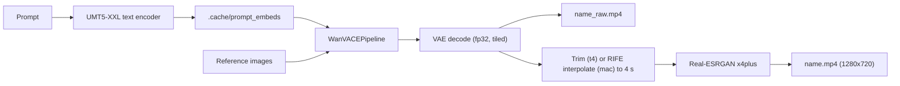

# video-gen

Generate **4-second, 16:9, 720p videos** from **reference images + a text prompt** with
[Wan2.1-VACE](https://huggingface.co/Wan-AI/Wan2.1-VACE-14B). Everything is free.

Reference images are used in one of two ways (`--ref-mode`):

- **`subject`** (CLI default): the images show a **subject, character, object, or style**, and the
  model generates a new scene around them. You can pass one or several.
- **`first-frame`** (notebook default): the first image **becomes frame 0** and the video animates
  it, keeping its face, colors, environment and lighting. Photos that aren't 16:9 are padded and
  the sides outpainted (`--fit pad`) or center-cropped (`--fit crop`). Any further images act as
  subject references.

There are two hardware profiles:

| Profile | Hardware | Model | Quality |
|---|---|---|---|
| `t4` (recommended) | NVIDIA T4 16 GB, e.g. free Google Colab | Wan2.1-VACE-**14B** + LightX2V distillation, GGUF Q3_K_M | Much better realism, anatomy, motion and reference fidelity |
| `mac` | Apple Silicon, 8 GB+ | Wan2.1-VACE-**1.3B** on MPS | Usable, noticeably softer and less coherent |

`--profile auto` (the default) picks `t4` when CUDA is available and `mac` otherwise.

## Google Colab (T4)

1. Push this project to GitHub.
2. In Google Drive, put your reference images in `MyDrive/video_gen/refs/`.
3. Open [`notebooks/colab_t4.ipynb`](notebooks/colab_t4.ipynb) in an empty Colab
   (`File > Open notebook > GitHub`, or upload it), choose
   `Runtime > Change runtime type > T4 GPU`, set `REPO_URL` in the first cell, and run the cells:

   | Cell | Does |
   |---|---|
   | 1. Clone the repo | `git clone` into `/content/video_generation` |
   | 2. Install | `ffmpeg` plus `pip install -e .` (keeps Colab's CUDA PyTorch) |
   | 3. Mount Google Drive | Uses `MyDrive/<WORK_REL_DIR>/refs` for inputs and `.../outputs` for results |
   | 4. Check runtime | GPU, VRAM, system RAM, free disk |
   | 5. Pull weights | ~21 GB: GGUF transformer (pick `QUANT` here), text encoder, VAE |
   | 6. Smoke test (optional) | Off by default (`RUN_SMOKE`) |
   | 7. Run | Copies references to local disk, generates, saves `<name>.mp4` and `<name>_raw.mp4` to Drive, previews |

   Drive is used only for the reference images and the output videos; weights stay on Colab's
   local disk.

Or from any CUDA machine:

```bash
pip install -e .
video-gen --profile t4 \
  --prompt "A young woman with curly hair walks slowly along a sunlit beach at golden hour, handheld camera, photorealistic" \
  --ref inputs/woman.png --out outputs/beach.mp4

# Animate a photo as-is
video-gen --profile t4 \
  --prompt "A young boy holding a toy gun slowly swings it to the left, then to the right, softly lit living room, handheld cinematic shot" \
  --ref inputs/boy.jpg --ref-mode first-frame --out outputs/boy.mp4
```

### What the t4 profile does

| Stage | Setting |
|---|---|
| Model | [VACE-14B with LightX2V step and CFG distillation merged in](https://huggingface.co/QuantStack/Wan2.1_T2V_14B_LightX2V_StepCfgDistill_VACE-GGUF), GGUF `Q3_K_M` (8.6 GB) |
| Generation | 768x432 (16:9), 65 frames (4 s at 16 fps, trimmed to exactly 64), 6 steps, guidance 1.0 |
| Scheduler | Flow-matching Euler, shift 5.0 (what the distillation was trained with) |
| Upscale | Real-ESRGAN x4plus on the GPU, then Lanczos to 1280x720 |

The whole clip is generated natively, so no frame interpolation is needed.

### Why these settings fit a free T4

A free Colab T4 has ~15 GB of usable VRAM and only ~12.7 GB of system RAM, so nothing can be
offloaded to the CPU; the 14B model must live entirely on the GPU.

- **Quantization.** The GGUF file is streamed onto the GPU one tensor at a time. `diffusers`'
  own loader reads all of it into RAM first, which crashes free Colab. Q3_K_M (8.6 GB) leaves
  ~6 GB of VRAM for activations; Q4 and larger files risk running out of VRAM during generation.
- **Resolution.** At 768x432 x 65 frames (+1 reference frame) the transformer works on ~23,000
  tokens per step, which needs roughly 4-5 GB of activations. The 8 VACE hints (~1.9 GB) are
  parked in system RAM until the main blocks use them, and `expandable_segments` avoids losing
  over 1 GB of VRAM to fragmentation. 1024x576 would need ~7 GB and doesn't fit next to the model.
- **Text encoder.** The 11 GB UMT5-XXL encoder is streamed straight to the GPU in float16 (its
  sensitive layers stay float32), used once, and freed before the transformer loads. Embeddings
  are cached in `.cache/prompt_embeds/`.
- **Distillation.** LightX2V lets the 14B model run in ~6 steps without classifier-free guidance,
  roughly 15x less compute than the original 50 steps with guidance.
- **Decoding.** The transformer is freed before the VAE decodes, so decoding has the whole GPU.

Estimated time per clip on a T4 (not measured): first run adds ~21 GB of downloads; after that,
roughly 2-4 min loading, 6-10 min denoising, and 2-3 min decoding and upscaling.

### Quality knobs on the t4 profile

| Option | Effect |
|---|---|
| `--quant Q3_K_L` | Slightly better than Q3_K_M; may run out of memory on a free T4 |
| `--quant Q4_K_S --resolution 288p` | Better weights at a lower generation size; usually Q3_K_M at 432p looks better after upscaling |
| `--steps 4` / `--steps 8` | Faster / marginally more detail |
| `--upscale 1080p` | 1920x1080 output |
| `--ref-strength 1.2` | Follow the references more closely (too high can look pasted-in) |

With more memory (Colab Pro high-RAM runtime with an L4/A100), use `--quant Q5_K_M` or `Q8_0` and
`--resolution 576p` or `720p`.

## Apple Silicon (mac profile)

Requirements: an Apple Silicon Mac, [`uv`](https://docs.astral.sh/uv/), and ~25 GB of free disk
(19 GB of weights plus room for swap).

```bash
uv sync
uv run video-gen --profile mac \
  --prompt "A knight in silver armor walking slowly through a misty pine forest at dawn, realistic" \
  --ref inputs/knight.png --out outputs/knight.mp4
```

The 1.3B model generates 33 frames at 512x288 in 20 steps. [RIFE](https://github.com/nihui/rife-ncnn-vulkan)
interpolates them to 64 frames (4 s), and [Real-ESRGAN](https://github.com/xinntao/Real-ESRGAN)
upscales them to 1280x720. Both are native Apple Silicon builds downloaded into `.tools/` on first use.

Measured on an 8 GB M1 (320x320, 17 frames, 8 steps):

| Stage | Time |
|---|---|
| First-run download (~19 GB) | ~25 min at ~12 MB/s |
| Text encoding (new prompt only) | ~20 min |
| Loading transformer + denoising + decoding | ~18 min |
| RIFE interpolation, 17 to 65 frames | ~4 s |
| Real-ESRGAN 4x upscale, 65 frames at 320x320 | ~4 min |

The default 288p, 33-frame, 20-step run is estimated at 1-2 hours. The 1.3B model is trained for
480p; generating at 720p directly would take days on an 8 GB M1.

## Output files

Each run writes:

- `outputs/<name>.mp4`: the final 16:9 video (720p, 4 s by default)
- `outputs/<name>_raw.mp4`: the model's original frames at the generation size, for comparison

## All options

`video-gen --help` lists everything. The most useful:

| Option | Default | Notes |
|---|---|---|
| `--profile` | auto | `t4`, `mac`, or `auto` |
| `--ref PATH` | none | Repeat for multiple references |
| `--ref-mode` | subject | `subject` (new scene with the referenced subject) or `first-frame` (animate the first `--ref` as-is) |
| `--fit` | pad | first-frame only: `pad` outpaints the sides of non-16:9 photos, `crop` center-crops |
| `--resolution` | profile | 288p (512x288), 432p (768x432), 576p (1024x576), 720p (1280x720) |
| `--seconds` | 4.0 | Final duration |
| `--no-interpolate` | off | Keep exactly the generated frames |
| `--upscale` | 720p | `none`, `720p`, `1080p` |
| `--frames` | profile | Generated frames, 4k+1 up to 81 |
| `--steps`, `--guidance` | profile | t4: 6 and 1.0; mac: 20 and 5.0 |
| `--quant` | Q3_K_M | t4 only |
| `--seed` | random | Set it to reproduce a result |

## How it works



Generation always runs in phases so the 11 GB text encoder never shares memory with the
transformer: encode the prompt, free the encoder, load the transformer and VAE, denoise, decode,
free the model, then post-process.

## Prompting tips for realism

- Describe the subject, action, setting, lighting, and camera, for example "close-up, handheld
  camera, soft natural light, shallow depth of field, photorealistic".
- Keep motion simple and gentle; 4-second clips handle one clear action best.
- Describe what should happen, not what shouldn't. Instructions like "do not change the face"
  don't work: the text encoder doesn't understand negation. To keep a photo's look, use
  `--ref-mode first-frame`.
- In `subject` mode, use reference images with a clean, uncluttered background. Each one is
  letterboxed onto a white canvas at the generation size.
- On the mac profile the default negative prompt suppresses common artifacts. The t4 profile runs
  without guidance, so negative prompts have no effect there.

## Troubleshooting

| Symptom | Fix |
|---|---|
| Colab: `CUDA out of memory` | Keep `--quant Q3_K_M` and `--resolution 432p`; try `--quant Q3_K_S`, or `--seconds 3` |
| Colab: session crashes or the cell prints `^C` while loading the model | System RAM ran out. Pull the latest code (the transformer now streams straight to the GPU); otherwise use a high-RAM runtime |
| Colab: `CUDA is not available` | `Runtime > Change runtime type > T4 GPU` |
| Colab: `cannot import name 'FqnToConfig' from 'torchao.quantization'` | `pip uninstall -y torchao` (the install cell does this; not needed here) |
| Mac: `MPS backend out of memory` | Use `--frames 17` and close other apps |
| Mac: `MLIR pass manager failed` or Conv3D errors | `uv sync --extra conv3d` then add `--conv3d-patch`; or `--device cpu --offload none` |
| Mac: black or noisy frames | `--dtype bfloat16` |
| `realesrgan-ncnn-vulkan` or `rife-ncnn-vulkan` failed | Delete `.tools/` to force a fresh download; or use `--upscale none` / `--no-interpolate` |

## Project layout

```
src/video_gen/
  config.py       profiles (mac, t4), GenConfig, validation
  pipeline.py     text encoding phase, model loading (MPS or GGUF on CUDA), generation
  postprocess.py  trimming, RIFE interpolation, Real-ESRGAN upscaling, final encode
  generate.py     command line interface (video-gen)
  utils.py        reference image loading
notebooks/
  colab_t4.ipynb  Google Colab notebook for the t4 profile
inputs/           your reference images
outputs/          generated videos
.tools/           downloaded RIFE and Real-ESRGAN files
```
